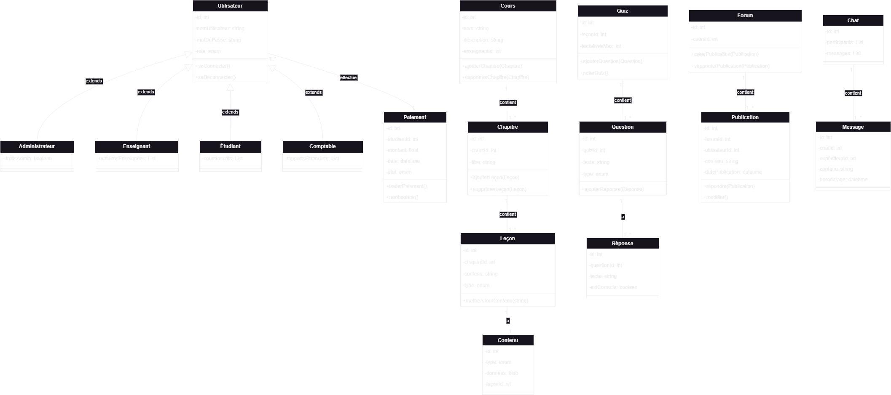
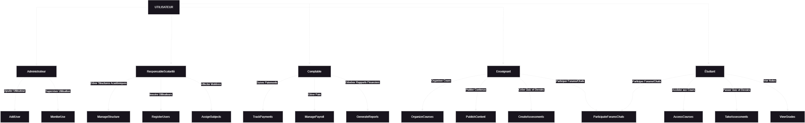
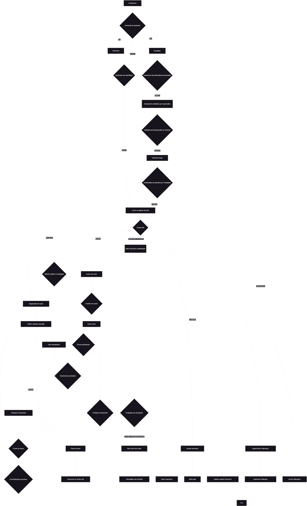
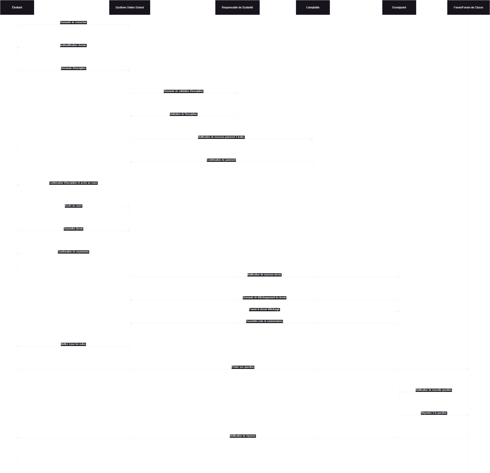

# Online School - Figma Design

Ce dépôt contient le design de la plateforme **Online School**, réalisé avec Figma.  
Le projet vise à développer une plateforme d'e-learning intuitive et interactive pour la gestion des classes, la collaboration entre enseignants et étudiants, ainsi que la gestion administrative.


## 📄 Fonctionnalités incluses dans le design

1. **Écran de connexion**  
   - Champs pour l'email et le mot de passe.  
   - Sélecteur de rôle (Admin, Étudiant, Enseignant, Responsable scolarité, Comptable).  
   - Bouton « Se connecter » et lien « Mot de passe oublié ? ».

2. **Tableau de bord** (Dashboard)  
   - Affiche les statistiques globales (nombre d’étudiants, de classes, de cours).  
   - Permet une navigation rapide vers les différentes sections (Cours, Étudiants, Enseignants, Paiements).  

3. **Gestion des classes**  
   - Liste des classes avec possibilité d’ajouter, modifier ou supprimer une classe.  
   - Vue détaillée des élèves inscrits dans chaque classe.

4. **Paiements**  
   - Liste des classes avec l’état des paiements pour chaque élève.  
   - Option pour générer un reçu ou un rapport des paiements.
4. **Chat**  
   - Possibilte dechanger avec dautres utilisateurs connectes en temps reel


---

## 📊 Diagrammes

Cette section contient les diagrammes UML nécessaires pour la plateforme **Online School** :

1. **Diagramme de classes**  
   

2. **Diagramme de cas d'utilisation**  
   

3. **Diagramme d'activité**  
   

4. **Diagramme de séquence**  
   

---

## 🔗 Lien vers le design Figma

Tu peux consulter et interagir avec le design directement sur Figma via ce lien :  
[Voir le design Figma](https://www.figma.com/design/dERtnin8RvoDrQR8RHxZtl/Untitled?node-id=0-1&t=kFmYYxcyVgZfn754-1)

---

## 🚀 Instructions pour utiliser le dépôt

1. Clone le dépôt :  
   ```bash
   git clone https://github.com/ton-utilisateur/online-school-design.git
